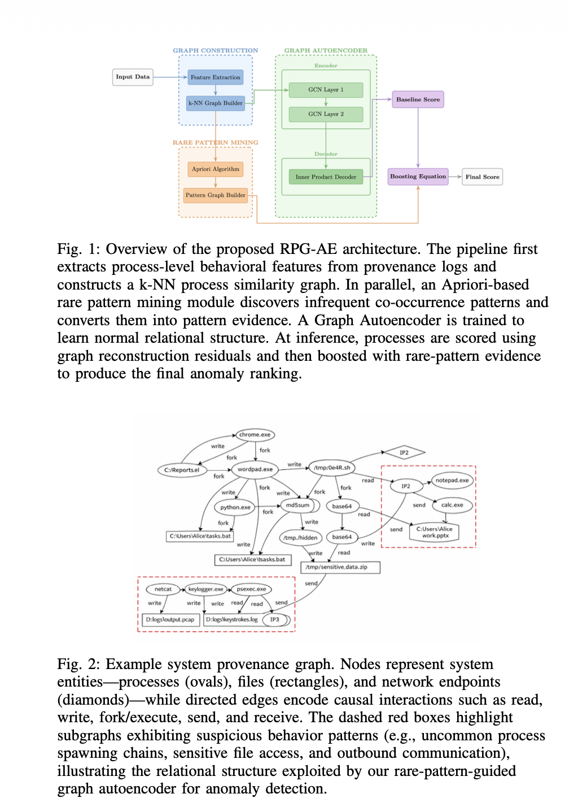

# RPG-AE: Neuro-Symbolic Graph Autoencoders for Anomaly Detection

An implementation of the [RPG-AE model](https://arxiv.org/abs/2602.02929) – a graph-based autoencoder for provenance-based anomaly detection using rare pattern mining.

## Overview

RPG-AE is a neuro-symbolic approach that combines graph neural networks with frequent pattern mining to detect anomalies in provenance logs. The model learns an autoencoder representation of normal process behavior and identifies anomalies as deviations from this learned pattern.

### Key Features

- **Graph-based encoding**: Uses GCN (Graph Convolutional Networks) for feature extraction
- **Rare pattern detection**: Identifies anomalies through infrequent behavioral patterns
- **Provenance analysis**: Designed for system-level behavioral analysis

## Architecture



The model consists of three main components:

1. **Feature Extractor**: Converts provenance logs into process-level feature matrices
2. **Graph Encoder**: Encodes features using graph convolutional networks
3. **Anomaly Detection**: Uses rare pattern mining to identify suspicious patterns

## Installation

### Requirements

- Python 3.8+
- PyTorch
- PyTorch Geometric
- scikit-learn
- mlxtend
- pandas
- numpy
- scipy

### Setup

```bash
# Install dependencies
pip install torch torch-geometric scikit-learn mlxtend pandas numpy scipy

# Clone the repository
git clone <repository-url>
cd RPG_AE
```

## Usage

### Quick Start

```bash
python run.py
```

This runs a demonstration with synthetic provenance data:

- 200 normal processes
- 20 anomalous processes

### Training

```python
from model import RPGAE, FeatureExtractor
import pandas as pd

# Load your provenance logs
df = pd.read_csv('provenance_logs.csv')

# Extract features
extractor = FeatureExtractor()
X, process_ids = extractor.from_dataframe(df)

# Initialize and train model
model = RPGAE(input_dim=X.shape[1])
anomaly_scores, anomalies = model.fit_predict(X)
```

## Project Structure

```
RPG_AE/
├── model.py          # Core model implementation (FeatureExtractor, RPGAE)
├── run.py            # Example usage with synthetic data
├── train.py          # Training utilities
├── readme.md         # This file
└── __pycache__/      # Python cache
```

## Model Components

### FeatureExtractor

Converts raw provenance logs into feature matrices. Default features include:

- File operations (reads, writes)
- Network connections
- Child processes
- Registry accesses
- Process duration
- CPU and memory usage

### RPGAE

The main autoencoder model that:

1. Encodes feature vectors into a latent representation using GCN
2. Decodes back to reconstruct the process features
3. Detects anomalies based on reconstruction error and rare patterns

## Citation

If you use this implementation, please cite the original paper:

```bibtex
@article{rpgae2026,
  title={RPG-AE: Neuro-Symbolic Graph Autoencoders with Rare Pattern Mining for Provenance-Based Anomaly Detection},
  year={2026},
  url={https://arxiv.org/abs/2602.02929}
}
```

## License

[Add your license here]

## Contributing

Contributions are welcome! Please feel free to submit issues and pull requests.

## References

- [Paper](https://arxiv.org/abs/2602.02929)
- PyTorch Geometric: https://pytorch-geometric.readthedocs.io/
- mlxtend Frequent Patterns: http://rasbt.github.io/mlxtend/
